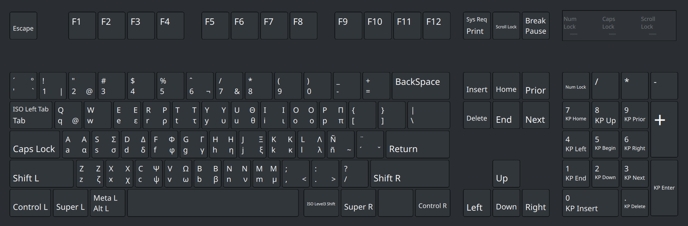
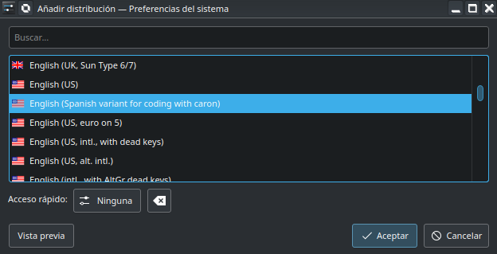

# My XKB keyboard distribution
This is a XKB US (Spanish variant for coding with caron) keyboard distribution.

This distribution is optimized for writing $\LaTeX$ code, with the `\` char on top of the `Enter` key, and the Greek alphabet available through `Alt-gr + key` or `Alt-gr + Shift + key`.



There may be space for improvement for Python coding. Specially the `+` sign is not very handy. Pull requests are welcome.

## Instalation
Clone the repo and apply the patches.
```
git clone
cd keyboard_config/src
sudo ./apply_patches.sh 
```
Go to your keyboard config tool and select the `uses` variant for the `us` keyboard. From a terminal, you can run `setxkbmap us uses` to activate the distribution temporarily. 

